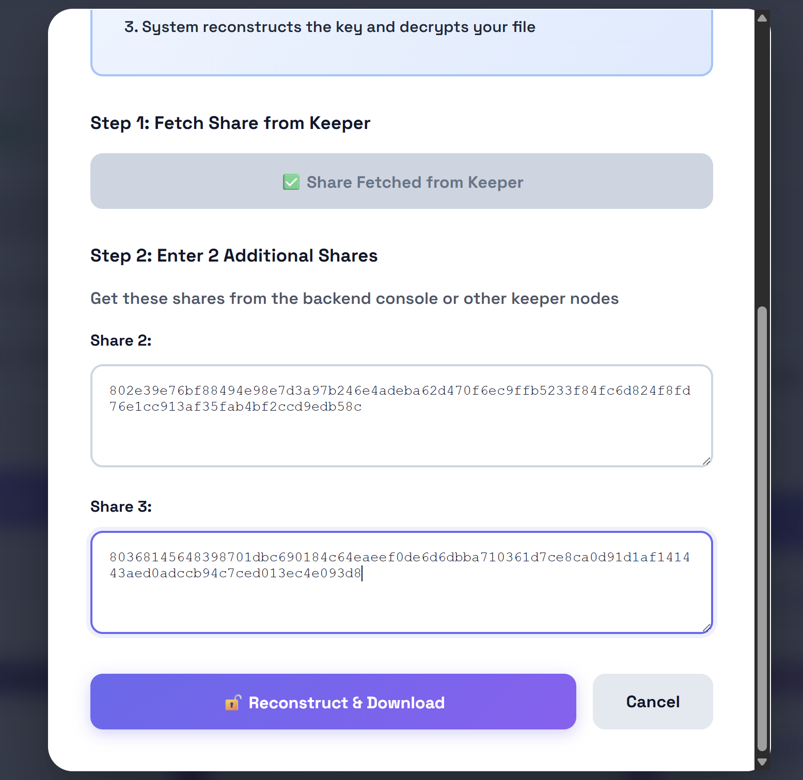

# TimeCrate: A Decentralized, Time-Locked Content Delivery System

[](https://reactjs.org/)
[](https://nodejs.org/)
[](https://soliditylang.org/)
[](https://ipfs.tech/)
[](https://ethers.io/)

TimeCrate is a decentralized system designed to address the challenge of securely storing and releasing digital content at a predetermined future time. By integrating blockchain technology, IPFS (InterPlanetary File System), and Shamir's Secret Sharing (SSS), this project provides a tamper-proof and trustless mechanism for time-locked data delivery.

The system encrypts content, distributes the decryption key shares to a network of independent "keeper" nodes, and uses an ERC-721 (NFT) smart contract to manage ownership and release conditions.

---

## Table of Contents

- [The Problem](#the-problem)
- [Core Features](#core-features)
- [System Architecture](#system-architecture)
- [Workflow](#workflow)
- [Getting Started](#getting-started)
  - [Prerequisites](#prerequisites)
  - [1. Clone the Repository](#1-clone-the-repository)
  - [2. Deploy the Smart Contract](#2-deploy-the-smart-contract)
  - [3. Backend Setup](#3-backend-setup)
  - [4. Keeper Network Setup](#4-keeper-network-setup)
  - [5. Frontend Setup](#5-frontend-setup)
- [License](#license)
- [Author](#author)

---

## The Problem

Traditional centralized services that act as escrow agents are vulnerable to numerous risks. They can be compromised by attackers, suffer from service outages, go out of business, or be coerced into releasing content prematurely. This centralization creates a single point of failure.

Furthermore, decentralized storage solutions like IPFS solve for content addressing, but not persistence. Files can be "forgotten" and disappear if no node is actively "pinning" them.

TimeCrate is designed to solve these challenges by providing a decentralized, trustless, and robust framework for storing and ensuring the automated release of digital content.

---

## Core Features

* **Trustless Time-Lock:** Content is locked until a specific timestamp. The release condition is enforced by the smart contract on the blockchain.
* **Decentralized Ownership:** Each TimeCrate is a unique ERC-721 (NFT). This means ownership is verifiable, transferable, and managed by the user, not a central company.
* **Tamper-Proof Storage:** The file itself, after being encrypted, is stored on IPFS. This provides a content-addressable, decentralized storage layer.
* **Resilient Key Management:** The AES-256 decryption key is never stored in one place. It is split into multiple "shares" using Shamir's Secret Sharing (e.g., a 3-of-5 threshold).
* **Decentralized Failover System:** The key shares are distributed to a network of independent "keeper" nodes. The system can tolerate the failure of multiple keepers (e.g., 2 out of 5) and still successfully reconstruct the key.

---

## System Architecture

The system is designed as a multi-layered architecture, separating concerns between the user interface, on-chain logic, and off-chain data management.


1.  **React Frontend:** A web application built with React and TypeScript. It serves as the user's portal to connect their MetaMask wallet, select a file, configure the release date, and manage their existing TimeCrates.
2.  **Solidity Smart Contract:** An ERC-721 contract deployed on the Ethereum (Sepolia) blockchain. It acts as the system's "source of truth," storing the critical metadata for each Crate: the IPFS Content ID (CID), the `releaseTime` (Unix timestamp), and the list of `keeperUrls`.
3.  **Node.js Backend (Orchestrator):** A trust-minimized server that performs the heavy lifting:
    * Encrypts the file with AES-256.
    * Uploads the encrypted blob to IPFS (via Pinata).
    * Splits the AES key into SSS shares.
    * Distributes the shares to the keeper network.
    * Handles the key reconstruction process during the unlock phase.
4.  **Keeper Network:** A set of independent Node.js servers (five in this implementation). Their sole job is to store a single key share. They are designed to be "stateless" in terms of rules; they must **always** ask the smart contract for permission before releasing their share.
5.  **IPFS (via Pinata):** The decentralized storage network where the encrypted file is durably stored. Pinata is used as a "pinning service" to ensure the file remains available.

---

## Workflow

### 1. The "Lock" Process (Crate Creation)

1.  The user selects a file and release date in the React frontend.
2.  The file is sent to the Node.js backend.
3.  The backend generates an AES key, encrypts the file, and uploads the encrypted blob to IPFS, receiving an `ipfsCid`.
4.  The backend splits the AES key into 5 SSS shares.
5.  It sends one share to each of the 5 independent keeper nodes.
6.  The backend returns the `ipfsCid` and the list of active `keeperUrls` to the React frontend.
7.  The frontend prompts the user to sign a blockchain transaction, calling the `createCrate` function to mint a new NFT and save the metadata on-chain.


### 2. The "Unlock" Process (Crate Release)

1.  The user visits the "My Crates" page, which queries the smart contract for all NFTs they own.
2.  The app checks the `isReleaseReady` function on the smart contract for a specific Crate.
3.  If the time has passed, the "Unlock" button is enabled.
4.  The user clicks "Unlock." The app automatically requests one share from an active keeper.
5.  The keeper node receives the request and **makes two read-only calls** to the smart contract to verify:
    * `ownerOf(tokenId)`: Is the requester the current NFT owner?
    * `isReleaseReady(tokenId)`: Has the time passed?
6.  If both checks pass, the keeper releases its share.
7.  The app then prompts the user to manually paste two additional shares (which they saved during creation).
8.  The app POSTs all 3 shares to the backend's `/api/reconstruct` endpoint.
9.  The backend combines the shares to reconstruct the AES key.
10. The backend fetches the encrypted file from IPFS, decrypts it in memory, and streams the decrypted file back to the user as a download.




---

## Getting Started

This project is a monorepo containing three main parts: `frontend`, `backend`, and `keeper`.

### Prerequisites

* [Node.js](https://nodejs.org/) (v16 or later)
* [MetaMask](https://metamask.io/) browser extension
* A Pinata account for IPFS pinning.
* An Ethereum testnet RPC URL (e.g., from [Alchemy](https://www.alchemy.com/) or [Infura](https://www.infura.io/)). The project is configured for **Sepolia**.

### 1. Clone the Repository

```bash
git clone <your-repository-url>
cd <your-project-folder>
2. Deploy the Smart Contract
Navigate to the contracts directory.

Install Hardhat and dependencies.

Configure your hardhat.config.ts with your Sepolia RPC URL and a private key (for deployment).

Deploy the TimeCrate.sol contract to the Sepolia testnet.

Copy the new contract address. You will need it for the frontend and keepers.

3. Backend Setup
The backend orchestrates encryption and key splitting.

Bash

# Navigate to the backend folder
cd backend

# Install dependencies
npm install

# Create a .env file and add your Pinata keys
# .env file contents:
# PINATA_API_KEY=your_pinata_api_key
# PINATA_SECRET_KEY=your_pinata_secret_key

# Run the backend server
node server.js
# Server will be running on http://localhost:3001
4. Keeper Network Setup
The keepers store and release the key shares. You must run each keeper as a separate process.

Bash

# Navigate to the keeper folder
cd keeper

# Install dependencies
npm install

# Create a .env file with your RPC URL and the deployed contract address
# .env file contents:
# SEPOLIA_RPC_URL=your_sepolia_rpc_url
# CONTRACT_ADDRESS=your_deployed_contract_address

# Run each keeper in a separate terminal
npm run keeper1 # Runs on port 4001
npm run keeper2 # Runs on port 4002
npm run keeper3 # Runs on port 4003
npm run keeper4 # Runs on port 4004
npm run keeper5 # Runs on port 4005
5. Frontend Setup
The frontend is the main user interface.

Bash

# Navigate to the frontend folder
cd frontend

# Install dependencies
npm install

# Create a .env.local file with your contract address and backend URL
# .env.local file contents:
# VITE_CONTRACT_ADDRESS=your_deployed_contract_address
# VITE_BACKEND_URL=http://localhost:3001

# Run the development server
npm run dev
# App will be running on http://localhost:5173
License
This project is licensed under the MIT License - see the LICENSE file for details.

Author
Byna Sriroop